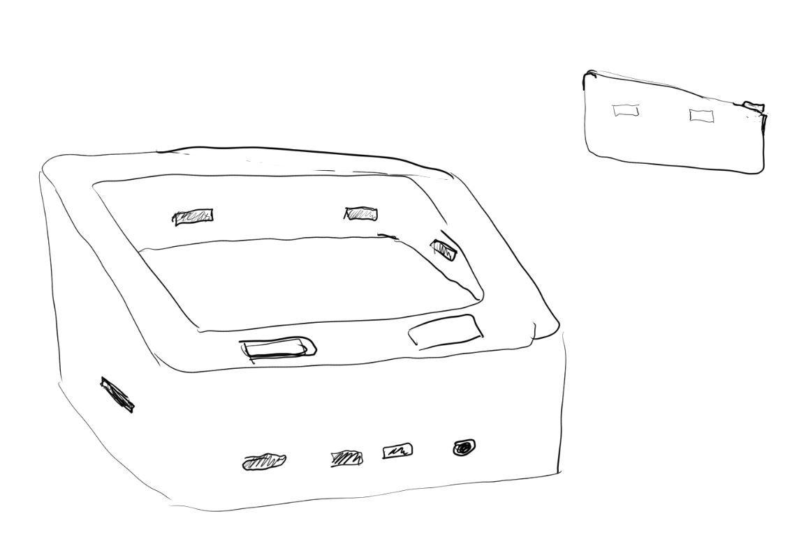

### A Raspberry Pi 4B case with built in ToF sensor trackpad/mouse

This is building on the [quadlidar trackpad](https://github.com/jdc-cunningham/quadlidar-mouse) project.

Ultimately attaching the visual camera keyboard would make this thing a full computer aside from the screen.

